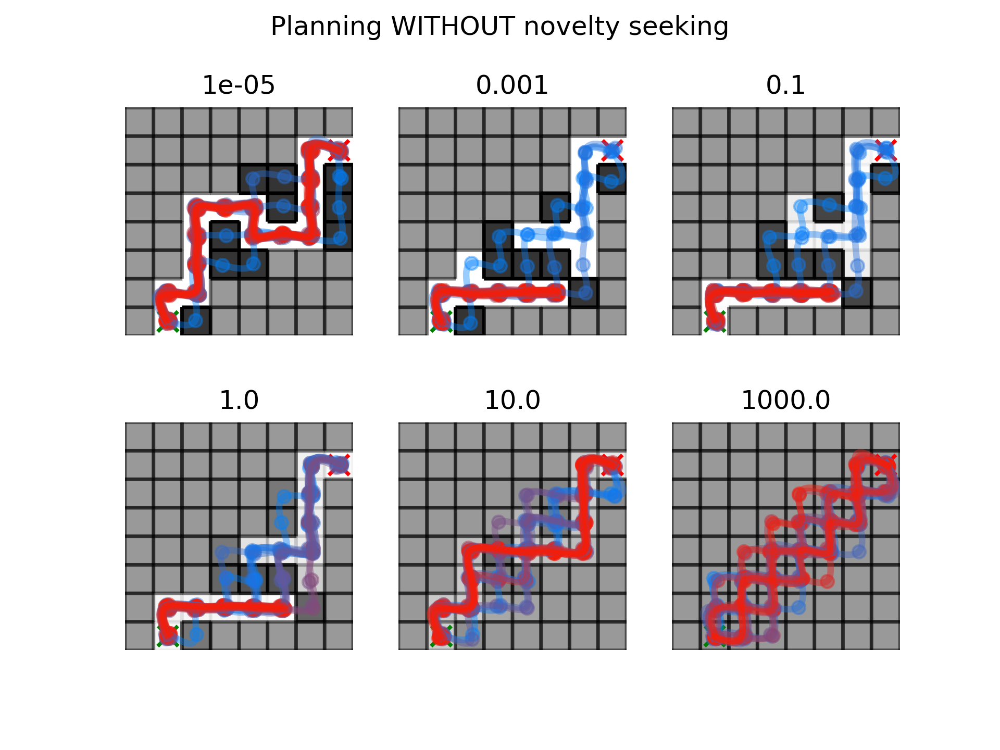

# Active Pynference
Python package for simulating perception, decision-making & learning in uncertain environments using Active Inference (and more precisely Sophisticated Inference).

This package started off as a simple Python port of the Wellcome Centre for Human Neuroimaging's SPM12 "MDP_VB_XX" files but we're continuously working on additionnal orignal features ! Work in progress !


## Status


What you can do using <b>actynf</b> :
- Build your own synthetic environments based on Markov Decision Processes using the *layer* class.
- Build Active-Inference models of those environments using the same *layer* class !
- Build networks of *layers* by creating *links* between them ! 
- Run simulations of agent behaviour & learning

We recently introduced a **Jaxified** version of Sophisticated Inference. Now, you can also : 
- JIT & Vectorize Sophisticated Inference simulations to make them faster !
- Use Inference librairies such as [numpyro](https://num.pyro.ai/en/latest/index.html#introductory-tutorials) to perform Bayesian Inference on empirical data and fit these models !  

What you cannot do (yet):
- Build hierarchical planning networks : layers receiving their observations from lower rank layers, and trying to plan actions (work in progress !).
- Perform structure learning
- Run the classical Active Inference (Policy comparison) scheme ... But you can [here](https://github.com/infer-actively/pymdp/tree/master) !
- Find [the answer to life the universe and everything](https://en.wikipedia.org/wiki/42_(number))


## Disclaimer !

This package is still under development ! Final testing and code cleaning are currently underway, be mindful of potential errors ! Contributions welcomed (feel free to write @ <come.annicchiarico@inserm.fr> !)

## Installation : 

In your Python environment, you (will soon be able to) install active-pynference using pip :
```
    pip install active-pynference
```

In the meanwhile, you can use the test version (be aware that there may be a plethora of bugs :/ ): 

```
pip install -i https://test.pypi.org/simple/ active-pynference
```

For more informations on package installation, check [the complete installation instructions notebook](demos/installation_instructions.ipynb).

## A general overview of the package design

## Examples 

- [Navigating a T-maze using Sophisticated Inference](demos/Tmaze_demo.ipynb)

A mouse has to pick either the left or the right (one-way) door. Behind one of the door is a reward (cheese), and behind the other is an adversive stimulus (mousetrap). The context may be either random or stable. The mouse also has access to a hint with an associated quality (i.e. *Does it actually provide any useful information about the reward whereabouts ?*). 

We use sophisticated inference to model the mouse learning both the context as well as the quality of the hint in various environments. Behavioural simulation outputs below : 


Reliable clue, random environment       | Reliable clue , environment stabilizes after trial 10 | Unreliable clue & random environment
:--------------------------------------:|:------------------------------------:|:------------------------------------:
 ||


- [Navigating a complex "soft" maze](demos/mazeX_demo.ipynb)

An agent is tasked with reaching a target cell in a complex "soft" maze. Contrary to a "hard" maze with uncrossable walls, there are adversive and neutral cells in this maze. An optimal agent tries to avoid adversive cells by exploring which cells are neutral and which cells are adversive. One interesting parameter we can play around in this simulation is the initial confidence of the agent regarding its prior mapping of the maze. When this confidence is very low, the agent will learn very fast. When it is too high, it won't learn at all. We can also toggle the novelty seeking part of the Sophisticated Inference planning algorithm to prompt more or less explorative behaviour.


<!--  -->

In this plot, the background represents the agent's final perception of the maze, with each cell's background reflecting the agent belief about the state of a cell (adversive = dark cells, neutral = bright cells).
We also plot the firstr 20 trajectories of the agent. The first ones are blue-ish, and the later ones are red-ish.


<!--  -->

This simulation shows the various trajectories of agents with varying initial confidence in their maze mappings. Importantly, the agents didn't actively try to improve their knowledge of the maze (i.e. novelty seeking) when planning new actions.


<!--  -->

Same plot as before, with the agents now actively trying to target unexplored cells to increase their knowledge of the maze.

## What is Active Inference ? Sophisticated Inference ?

Get in touch with the Active Inference ecosystem : 
- A nice syllabus : https://jaredtumiel.github.io/blog/2020/10/14/spinning-up-in-ai.html
- The original Matlab implementation of Sophisticated Inference : https://github.com/spm/spm/blob/main/toolbox/DEM/spm_MDP_VB_XX.m
- The original Sophisticated Inference paper : Karl Friston, Lancelot Da Costa, Danijar Hafner, Casper Hesp, Thomas Parr; Sophisticated Inference. Neural Comput 2021; 33 (3): 713–763. doi: https://doi.org/10.1162/neco_a_01351

## Paper / cite me !

We'll see about that later 	¯\\_(ツ)_/¯.